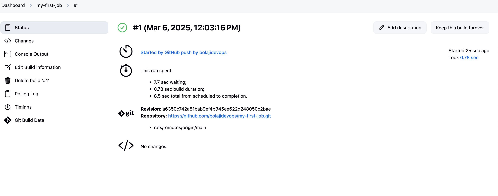

## Jenkins Job

In Jenkins, a job is a unit of work or a task that can be executed by the Jenkins automation server. A Jenkins job represents a specific task or set of tasks that needs to be performed as part of a build or deployment process. Jobs in Jenkins are created to automate the execution of various steps such as compiling code, running tests, packaging applications, and deploying them to servers. Each Jenkins job is configured with a series of build steps, post-build actions, and other settings that define how the job should be executed. Creating a Freestyle Project Let's create our first build job.

### Creating a Freestyle Job

- From the dashboard menu below, the new item is clicked on.

- Creating a freetyle project and naming it my-first-job

### Connecting Jenkins To Our Source Code Management

Now that we have created a freestyle project named (my-first-job), we need to connect our Jenkins to github.

- Creating a new github repository called (my-first-job).

- Connecting jenkins to  repository (my-first-job) by pasting the repository url in the jenkins settings area, Making sure my current branch is `main`

- And Saving the configuration and run "build now" to connect jenkins to my repository.

### Configuring Build Trigger 

As an engineer, automating makes our work easier in possible ways. I have connected jenkins to my-first-job, but i can't run a new build with clicking on 'Build Now' To eliminate this, I need to confiure a build trigger to my jenkins job. With this, jenkins will run a new build anytime a change is made to my github repository 

- Click "Configure" your job and add this configurations.

- Click on build trigger to configure triggering the job from GitHub webhook.

- Creating a github webhook using jenkins ip address and port Now, once i push to my GitHub repository (e.g. README.MD file) a new build will be launched automatically (by webhook).